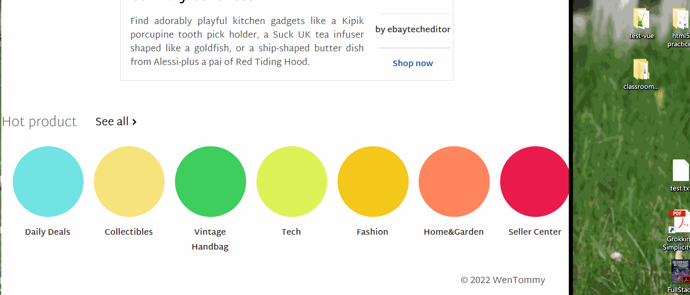

## 说明

一个模仿 e-Bay 首页的练习。使用了 media query 实现不同屏幕宽度下的页面元素数量变化。


效果1：随着宽度缩小，导航栏显示的 item 数量减少，减少的部分被收到一个 More 按钮中。

效果1-实现思路：media query 到指定屏幕宽度时，设置最后几项 item 的 `displayer:none`，同时缩小剩余 item 的**容器宽度**。



效果2：一行7个圆，随屏幕宽度减少，圆宽度也缩小；屏幕宽度小到一定程度，3个圆被挤到第二行，同时还和上面的4个圆保持相同大小。

效果2-实现思路：

- 圆的大小随着屏幕宽度减小：圆的容器宽度设为 100vw，每个圆的宽度用 `calc()` 计算，公式为：一个圆的宽 = (容器宽 - padding * 2 - column-gap * 6) / 7
- 3 个圆被挤到第二行：这是因为第二行本来就有3个圆，一开始时的 `displayer:none`。屏幕小到 `767px` 后第一行最后 3 个圆消失，第二行 3 个圆出现。
- 第二行 3 个圆的位置处于第一行 4 个圆的缝隙：设置容器的 `padding-left` 直至出现相应效果。

第一行和第二行的圆处于同一个容器 `.container` 下，当屏幕宽小于 767px 时，要设置它的`grid-template-areas`：

```css
/** */
section.card .container {
    grid-template-columns: repeat(4, 1fr);
    grid-template-areas: 
    "a b c d"
    "second second second second"
  }
```
