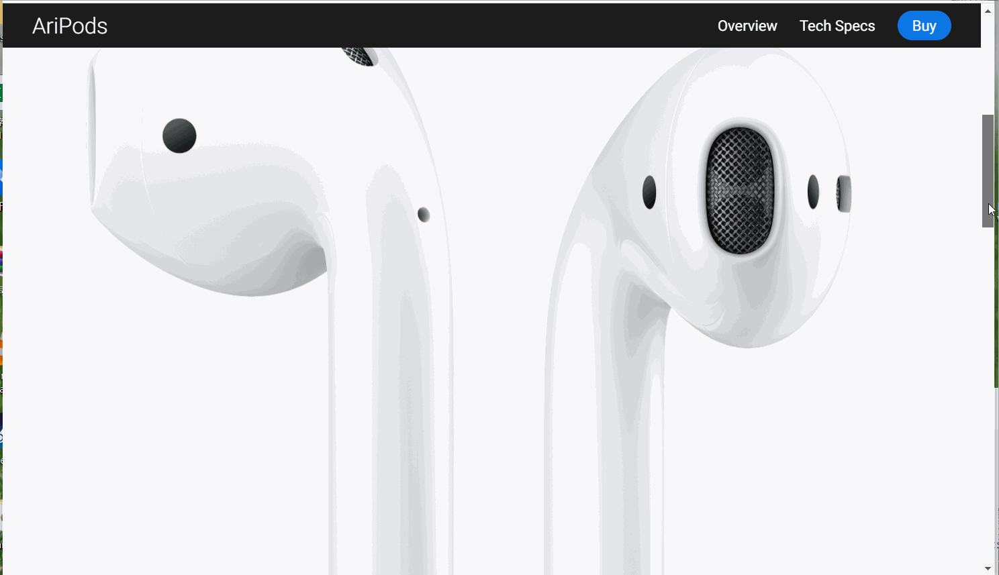

## 说明

一个练习 `scss` 写的 AirPods 产品的简化页面。效果如图：

写 scss 的过程：

1. 开发者按照 scss 的语法写代码，保存为 .scss 文件
2. scss 转译器将 .scss 文件转义成 css 文件
3. html 文档引用最终的 css 文件渲染样式

所以 scss 是改善开发过程中的体验的工具。

### 使用 scss 的几点感受

1. 选择器的嵌套语法提供了类似作用域的概念，写的样式的时候，可以把与相应的 html 结构带入过来，认识负担轻。仅这一点，就值得。
2. 变量可单独放到一个文件中归置起来，开发者的认知工作从熟悉具体的值到熟悉变量名。
3. @extends 语法可以将相同的样式的 css 代码节约掉。
