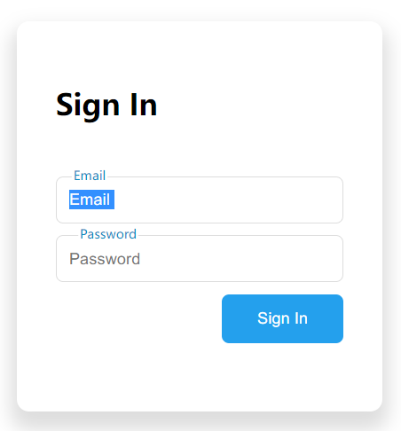

## 说明

实现一个输入框 `focus` 状态下，placeholder 文字会显示到边框上方的效果。

### 思路1：用消失/显示效果

使用 `input` 自带的 `placeholder` 属性。

非 focus 时：显示 `placeholder` 属性中的文字
focus 时：隐藏`placeholder` 属性的文字，显示输入框顶部的绝对定位的文字。



实现了一下效果不好，第 2 种用动画的思路更好。

### 思路2：用动画

不用 `input` 自带的 `placeholder` 属性。


### 其他：实现按钮居右

第一种：设置按钮所在的容器设为 `displaye: flex` + `justify-content: flex-end` ：
```css
.sign-btn-wrapper {
  margin-left: auto;
  display: block;
}
```

第二种，设置按钮本身，联合使用 `displaye: block` 和 `margin-left: auto`：

```css
.sign-btn-wrapper .sign-btn {
  margin-left: auto;
  display: block;
}
```
