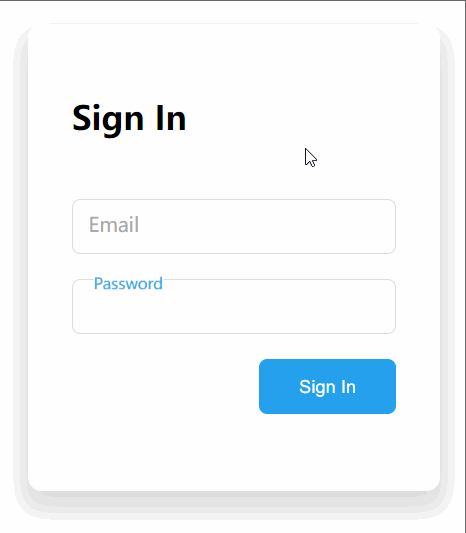

## 说明

实现一个输入框 `focus` 状态下，placeholder 文字会显示到边框上方，且输入框有文字时会停留在上方的效果，如下图：



### 思路1：用消失/显示效果

使用 `input` 自带的 `placeholder` 属性。

非 focus 时：显示 `placeholder` 属性中的文字
focus 时：隐藏`placeholder` 属性的文字，显示输入框顶部的绝对定位的文字。


实现了一下效果不好，第 2 种用动画的思路更好。

### 思路2：用动画

html:

```html
<div class="input-wrapper">
  <input type="email" class="text-input email" placeholder=" ">
  <label class="input-label">Email</label>
</div>
```

思路：

1. 将表单的 `<label>` 标签用作 placeholder，将 `<input>` 自带的 placeholder 属性值设为**一个空格**。
2. `<input>` 与 `<label>` 皆相对容器绝对定位
3. `<input>` focus 时，修改 `<label>` 的 `top` 与 `left` 属性改变其位置
4. 输入框有文字时，使 `<label>` 维持 3 中的状态。

1-3 使用绝对定位。问题在第4点，css 中如果获取输入框文字，且没有 focus 的状态？

换一种角度：获取没有 placeholder 且没有 focus 的状态，这是将 `<input>` 自带的 `placeholder` 属性值设为**一个空格**的原因：

```css
/* placeholder 没有显示状态下，且没有focus的 text-input 的相邻兄弟选择器 input-label */
.text-input:not(:placeholder-shown).text-input:not(:focus) + .input-label {

}
```

完整 css:
```css
.input-wrapper {
  position: relative;
}

.text-input {
  border: 1px solid #ddd;
  border-radius: 6px;
  padding: 10px;
  outline: none;

  position: absolute;
  background-color: transparent;
  z-index: 1;
}

.text-input:focus {
  border: 1.5px solid #24a0ed;
}

.input-label {
  background-color: white;
  position: absolute;
  color: #aaa;

  top: 0.55rem;
  left: 0.75rem;
  font-size: 0.9rem;

  z-index: 2;

  transition: .3s;
  pointer-events: none;
}

.text-input:focus + .input-label {
  top: -0.55rem;
  left: 0.5rem;

  transform: scale(0.75);
  color: #24a0ed;
  font-weight: 500;
}

/* placeholder 没有显示状态下，且没有focus的 text-input */
.text-input:not(:placeholder-shown).text-input:not(:focus) + .input-label {
  top: -0.55rem;
  left: 0.5rem;

  transform: scale(0.75);
  color: #aaa;
  font-weight: 500;
}

```

不用 `input` 自带的 `placeholder` 属性。

### 其他：实现按钮居右

第一种：设置按钮所在的容器设为 `displaye: flex` + `justify-content: flex-end` ：
```css
.sign-btn-wrapper {
  margin-left: auto;
  display: block;
}
```

第二种，设置按钮本身，联合使用 `displaye: block` 和 `margin-left: auto`：

```css
.sign-btn-wrapper .sign-btn {
  margin-left: auto;
  display: block;
}
```
