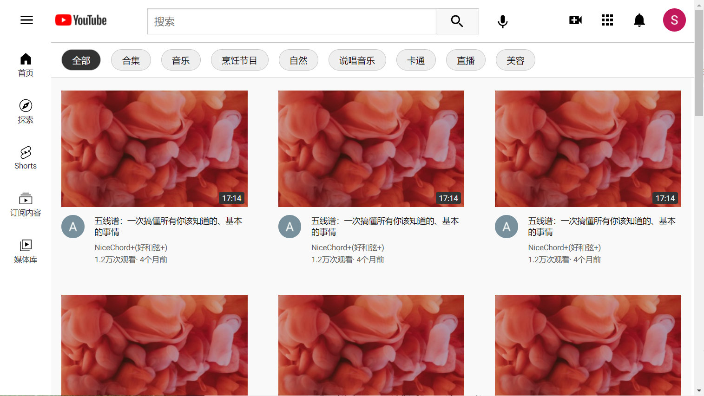
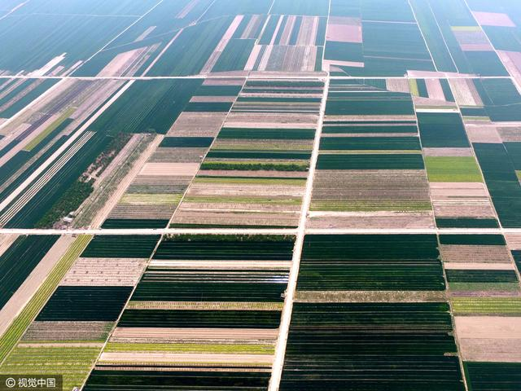
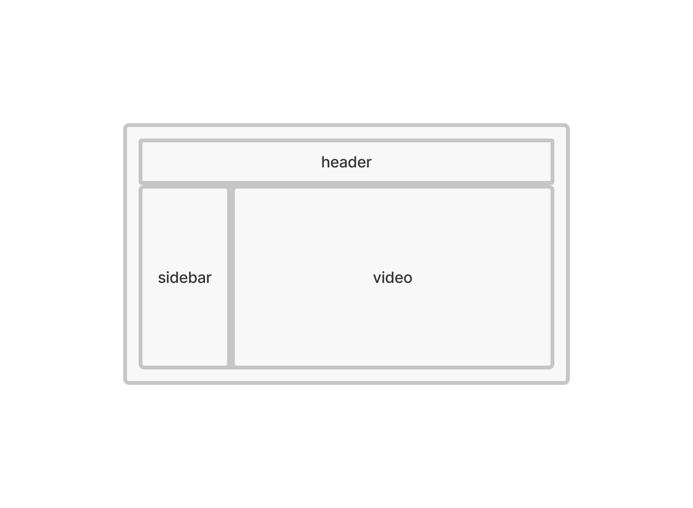

## 说明

Youtube 首页静态克隆项目，效果如图：



大量使用 `flex`，适量使用 `grid`，少量使用 `position: fixed`。

### 一、主要体会

一维布局用 `flex`，纵横布局用 `grid`。使用 `grid` 时，`grid-template-column`的 `auto-fill`值是神器。

### 二、写这个项目之前不会的概念

- `flex`:  一维布局用 `flex`；
- `grid`：纵横布局用 `grid`

### 三、几个问题

#### 3.1 怎么让内部元素撑满父级元素且能自动适应宽度

1. 为父元素设定宽度，但不是固定宽，而是设置左右边距来实现可变化的宽度
2. 设置父元素为 flex 容器，设置`flex-grow`，让子元素能占满剩余空间

```css
.container {
  display: flex;
  flex-grow: 1;
  margin: 0 2rem;
}

.child {
  width: 100%;
}

```

将容器设为 `flex`弹性盒子是一种常见的操作。

#### 3.2 怎么确定 container 的宽度？

方法1：设置固定宽度。
方法2：设置左右内边距，如 `padding: 0 2rem;` ，在子元素宽度确定的情况下，会自动撑开容器盒子的宽。而子元素的宽一般是确定值。

#### 3.3 grid 的自适应问题

[Grid MDN](https://developer.mozilla.org/zh-CN/docs/Web/CSS/CSS_Grid_Layout/Basic_Concepts_of_Grid_Layout)

使用网格的意思是，我希望这个布局天然就有行和列的概念，不是一条绳子因为宽度太长摆不下而折叠几道形成多行，而是天然就是一格一格像表格一样的组织结构。



使用 grid 的时候，好像在俯视阡陌纵横的耕田一样。田地是 column 和 row，田陇是 grid-gap。

展现奇迹的时候：`repeat(auto-fill, minmax(250px, 1fr))`

现在网格多少会根据浏览器宽度自行适应。

#### 3.4 解决绝对定位父元素无法产生滚动条

克隆 Youtube 首页过程中遇到的问题。

布局图：



html 结构：

```html
<div class="header">
</div>

<div class="mainbody">
  <div class="sidebar"></div>
  <div class="video">
    <div class="video-content">
    </div>
  </div>
</div>
```

问题：

```css
.video {
  position: fixed;
  left: 80px; // 给 sidebar 留出的空间
}
```

将右边的 `video`容器设为 `fixed` 定位后，如果其内容高度超过了此容器，超出部分的内容会隐藏，而不会出现滚动条。原因是绝对定位脱离了 normal flow，它的子元素内容的宽高都和它没关系。

期望能出现竖向滚动条。

修改：

```css
.video {
  position: relative; // 将 fixed 改为 relative 即可出现滚动条
  left: 80px; // 给 sidebar 留出的空间
}
```

#### 3.5 怎么把网页上的 `<svg>` 标签保存为 svg 图片？

1. F12，找到 `svg` 标签元素；
2. 右击`<svg>`标签，选择【Edit as HTML】并点击，Ctrl+A全选，右键点击并复制；
3. 打开文本编辑软件，新建文件，粘贴；
4. 在`<svg>` 标签代码中增加这个属性：`xmlns="http://www.w3.org/2000/svg"`
5. 保存文件，后缀修改为 `.svg`


---


2022-03-08

Tommy

